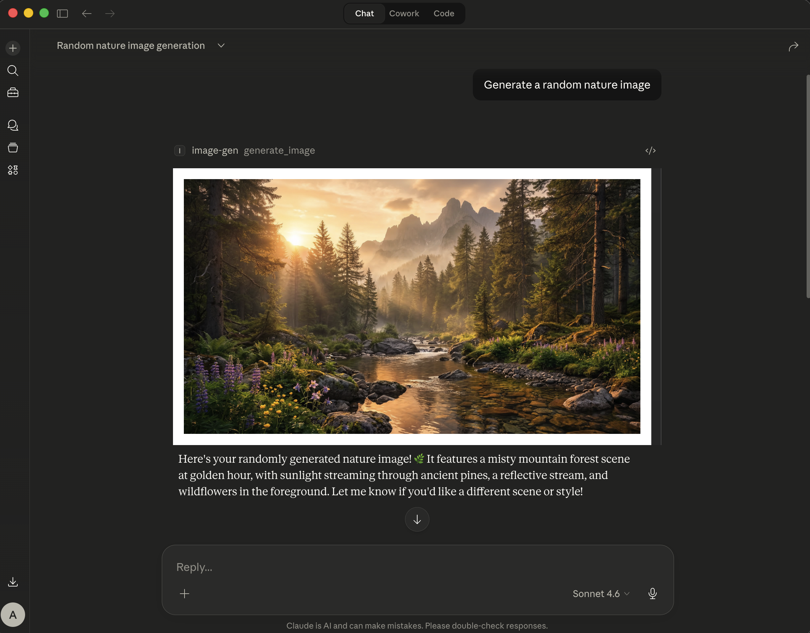
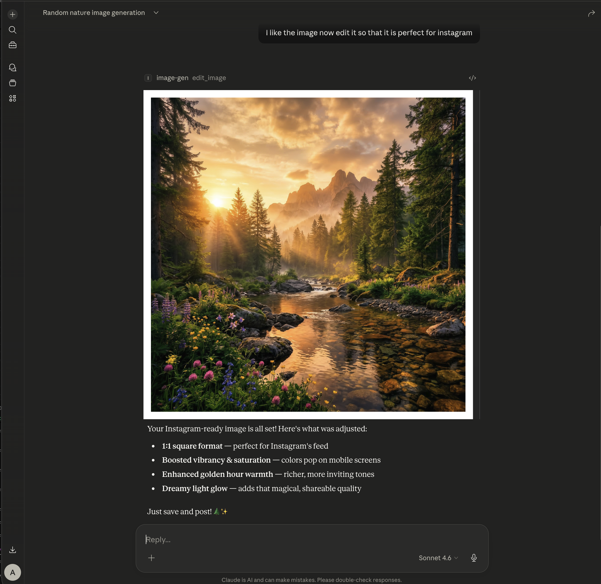

# Image Gen MCP

A FastMCP HTTP server that generates and edits images using the Google Gemini image model.

## Screenshots

**Generating an image** — Claude calls `generate_image` and the result renders inline:



**Editing an image** — following up with `edit_image` to reformat for Instagram:



## Table of Contents

- [Files](#files)
- [Setup](#setup)
  - [1. Install](#1-install)
  - [2. Obtain credentials](#2-obtain-credentials)
  - [3. Set environment variables](#3-set-environment-variables)
  - [4. Run the server](#4-run-the-server)
- [Register with an MCP host](#register-with-an-mcp-host)
- [Tools](#tools)
  - [generate\_image](#generate_image)
  - [edit\_image](#edit_image)
  - [Aspect ratio values](#aspect-ratio-values)
- [Notes](#notes)

## Files

| File / Directory | Purpose |
|---|---|
| `image_gen_mcp/` | The MCP server package |
| `image_gen_mcp/config.py` | Environment variable configuration and validation |
| `image_gen_mcp/types.py` | `AspectRatio` and `Resolution` type aliases |
| `image_gen_mcp/ui.py` | Prefab UI CSP patching for inline image rendering |
| `image_gen_mcp/client.py` | Google GenAI client initialization |
| `image_gen_mcp/image_utils.py` | Image loading, saving, and result-collection helpers |
| `image_gen_mcp/tools.py` | MCP tool definitions (`generate_image`, `edit_image`) |
| `image_gen_mcp/server.py` | Transport entry point (stdio / HTTP) |
| `pyproject.toml` | Package metadata and entry point |
| `requirements.txt` | Python dependencies |

## Setup

### 1. Install

**From GitHub (recommended):**

```bash
pip install git+https://github.com/AByteCoder/Image-Gen-MCP.git
```

**From a local clone:**

```bash
pip install /path/to/image-gen-mcp
```

Or in editable mode for development:

```bash
pip install -e /path/to/image-gen-mcp
```

**From requirements only:**

```bash
pip install -r requirements.txt
```

### 2. Obtain credentials

**Option A — Gemini API key**

1. Go to [Google AI Studio](https://ai.google.dev/gemini-api/docs/api-key) and sign in.
2. Click **Get a Gemini API key** and create a new key (or copy an existing one).
3. Store the key somewhere safe; you will pass it as `GEMINI_API_KEY`.

**Option B — Google service account (Vertex AI)**

1. In the [Google Cloud Console](https://docs.cloud.google.com/iam/docs/service-accounts-create), open the project you want to use and enable the **Vertex AI API**.
2. Navigate to **IAM & Admin → Service Accounts** and click **Create service account**.
3. Fill in a name, then on the **Grant access** step assign the **Vertex AI User** role (`roles/aiplatform.user`).
4. After creating the account, open it, go to the **Keys** tab, click **Add Key → Create new key**, and choose **JSON**.
5. Download the JSON file; you will pass its path as `GOOGLE_SERVICE_ACCOUNT_FILE`.

---

### 3. Set environment variables

| Variable | Required | Default | Description |
|---|---|---|---|
| `GEMINI_API_KEY` | Yes (or service account) | — | Your Google Gemini API key |
| `GOOGLE_SERVICE_ACCOUNT_FILE` | Yes (or API key) | — | Path to a Google service account JSON key file (alternative to API key) |
| `GOOGLE_VERTEX_LOCATION` | No | `global` | Vertex AI location; only used when authenticating via service account |
| `IMAGE_OUTPUT_DIR` | No | `./images` | Directory where generated/edited images are saved |
| `IMAGE_MODEL` | No | `gemini-3.1-flash-image-preview` | Gemini model to use for image generation |
| `HOST` | No | `0.0.0.0` | Bind address for the HTTP server |
| `PORT` | No | `56789` | Listen port for the HTTP server |
| `MCP_TRANSPORT` | No | `http` | Default transport when `--transport` flag is absent: `stdio` or `http` |
| `BASE_URL` | No | `http://localhost:{PORT}` | Public base URL used to construct image URLs returned to the LLM |
| `MCP_PATH` | No | `/mcp` | Mount path for the MCP endpoint |

Either `GEMINI_API_KEY` or `GOOGLE_SERVICE_ACCOUNT_FILE` must be set; the server will raise an error on startup if neither is present.

**API key auth:**

```bash
export GEMINI_API_KEY=your_api_key_here
export IMAGE_OUTPUT_DIR=/path/to/your/images   # optional
```

**Service account auth (Vertex AI):**

```bash
export GOOGLE_SERVICE_ACCOUNT_FILE=/path/to/service_account_key.json
export GOOGLE_VERTEX_LOCATION=us-central1      # optional, defaults to global
```

### 4. Run the server

**stdio transport** (default — for MCP hosts that manage the process):

```bash
image-gen-mcp --transport stdio
```

**HTTP transport** (for persistent or remote MCP hosts):

```bash
image-gen-mcp --transport http
```

Or using the Python module directly:

```bash
python -m image_gen_mcp --transport stdio
python -m image_gen_mcp --transport http
```

## Register with an MCP host

The server supports two transports. Choose the one your MCP host requires.

**HTTP transport** — add to your MCP host config (e.g. Claude Desktop `config.json`):

```json
{
  "mcpServers": {
    "image-gen-mcp": {
      "type": "http",
      "url": "http://localhost:56789/mcp"
    }
  }
}
```

Adjust `url` if you changed `HOST`, `PORT`, or `MCP_PATH`.

**stdio transport** — add to your MCP host config:

```json
{
  "mcpServers": {
    "image-gen-mcp": {
      "type": "stdio",
      "command": "image-gen-mcp",
      "args": ["--transport", "stdio"],
      "env": {
        "GEMINI_API_KEY": "your_api_key_here"
      }
    }
  }
}
```

## Tools

### `generate_image`

Generate a new image from a text prompt.

| Parameter | Type | Required | Default | Description |
|---|---|---|---|---|
| `prompt` | string | Yes | — | Text description of the image to generate |
| `filename_prefix` | string | No | `generated` | Prefix for the saved filename |
| `aspect_ratio` | string | No | — | Output aspect ratio (see values below) |
| `resolution` | string | No | `1K` | Output resolution: `512px`, `1K`, `2K`, `4K` |

---

### `edit_image`

Edit one or more existing images using a text prompt.

| Parameter | Type | Required | Default | Description |
|---|---|---|---|---|
| `image_path` | list[string] | Yes | — | Absolute file paths or HTTP(S) URLs to the source image(s) |
| `prompt` | string | Yes | — | Text description of the desired edits |
| `filename_prefix` | string | No | `edited` | Prefix for the saved filename |
| `aspect_ratio` | string | No | — | Output aspect ratio (see values below) |
| `resolution` | string | No | `1K` | Output resolution: `512px`, `1K`, `2K`, `4K` |

---

### Aspect ratio values

`1:1`, `1:4`, `1:8`, `2:3`, `3:2`, `3:4`, `4:1`, `4:3`, `4:5`, `5:4`, `8:1`, `9:16`, `16:9`, `21:9`

---

## Notes

- Images are saved as PNG with a timestamp suffix, e.g. `generated_20260307_143022.png`.
- The model defaults to `gemini-3.1-flash-image-preview`. Override it with the `IMAGE_MODEL` env variable.
- Each tool response includes an absolute `file_path` and a `url` pointing to the served image.
- Generated images are served as static files at `{BASE_URL}/images/<filename>`.
- A `/health` endpoint is available for liveness checks.
- Multiple images passed to `edit_image` are composited or used as references within a single generation request.
